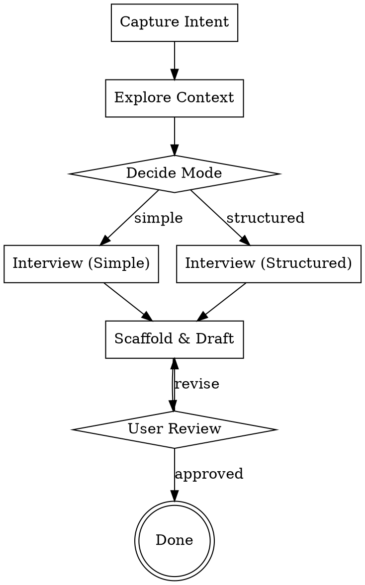

# Skill Creator

Create effective, well-structured skills through collaborative interview. Supports two modes: **simple** (single SKILL.md) and **structured** (multi-directory with orchestrator).

## Default Target

Create user-authored skills under `skills/<category>/<skill-folder>` in this repository (the agent-skills repo) unless the user explicitly asks for another location.

After creating or renaming a skill, run the link script so all agents (Claude Code, Codex, Pi, ZCode) discover it through their user skill directories:

- **macOS:** `./scripts/macos/link.sh`
- **Windows:** `powershell -ExecutionPolicy Bypass -File .\scripts\link.ps1`

Do not create new user-authored skills directly under `~/.claude/skills`, `~/.codex/skills`, `~/.pi/agent/skills`, or `~/.zcode/skills`; those directories are discovery surfaces.

## Workflow

## Step 1: Capture Intent

Ask: What should this skill do? Get a clear one-sentence description of the skill's purpose.

## Step 2: Explore Context

- Check `skills/` in this repo for existing user-authored skills that overlap or could serve as patterns
- Check the discovery dirs (`~/.claude/skills/`, `~/.codex/skills/`, `~/.pi/agent/skills/`, `~/.zcode/skills/`) only when validating discovery links
- Check the user's project for domain context if relevant
- Note any existing conventions to follow

## Step 3: Decide Mode

Read `instructions/complexity-decision.md` for the full criteria. Present recommendation with reasoning. User overrides.

## Step 4: Interview

Read `instructions/interview-guide.md`. Ask questions one at a time, multiple choice when possible.

- **Simple mode:** Focus on triggers, core knowledge, examples, common mistakes
- **Structured mode:** Also determine which directories are needed and what goes in each

Conclude with a summary of planned files for user approval before writing anything.

## Step 5: Scaffold & Draft

Read `instructions/authoring-rules.md` for CSO, frontmatter, and writing guidelines.

- **Simple mode:** Write single SKILL.md using `templates/simple-skill.md`
- **Structured mode:** Create directories and files. Use `templates/structured-skill.md` for the orchestrator SKILL.md. Read `references/structured-directory-spec.md` for what goes in each directory. If the skill has an eval layer, read `references/eval-layer-guide.md`.
- Update `manifest.json` (repo root) so the new skill appears in `managedSkills` with a flat discovery `name` and categorized `source`. On commit, the pre-commit hook regenerates this automatically — run `./scripts/macos/sync-manifest.sh` (macOS) or `.\scripts\sync-manifest.ps1` (Windows) to update it manually.
- Run the link and validate scripts:
  - **macOS:** `./scripts/macos/link.sh` then `./scripts/macos/validate.sh`
  - **Windows:** `.\scripts\link.ps1` then `.\scripts\validate.ps1`

## Step 6: Review & Iterate

Present the skill to the user. Iterate on feedback until approved.

## Key Rules

- One question at a time during interview
- Only scaffold directories identified as needed — no empty placeholders
- SKILL.md description starts with "Use when..." — never summarize workflow
- Keep structured SKILL.md under 150 lines; simple under 500
- No README, CHANGELOG, or auxiliary docs in skill directories
